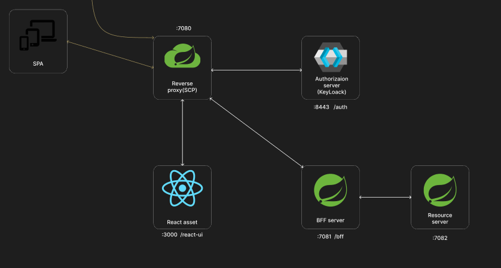
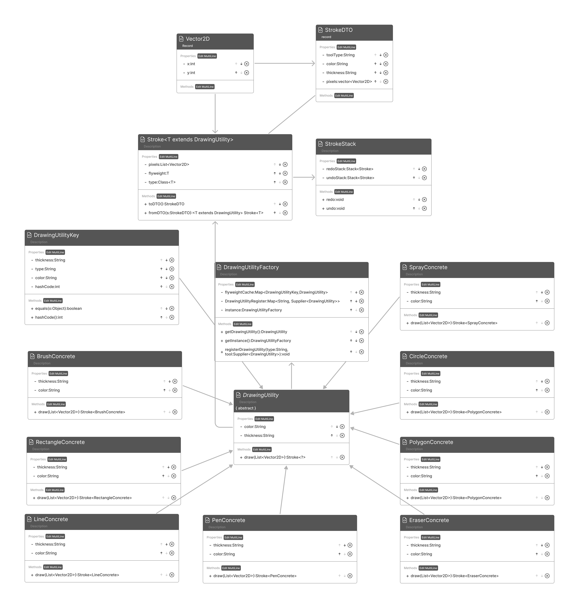

# Lama Puzzle

[](LICENSE)

Lama Puzzle is an engaging, interactive puzzle game that challenges you to rearrange pieces and reveal the hidden image of a llama. With intuitive gameplay, multiple difficulty levels, and a responsive design, Lama Puzzle is perfect for puzzle enthusiasts of all ages!

## Table of Contents

- [Introduction](#introduction)
- [Features](#features)
- [Installation](#installation)
- [How to Play](#how-to-play)
- [Contributing](#contributing)
- [License](#license)
- [Contact](#contact)

## Introduction

Lama Puzzle offers a fun twist on classic sliding and rearrangement puzzles. Your goal is to solve increasingly challenging puzzles by positioning pieces in the correct order until the full llama image is revealed. Whether you have a few minutes or want to dive deep into the puzzle mechanics, Lama Puzzle has something for everyone.

### Architect

#### Auth server (Backend for fontend)



### Core gameplay(Fly weight)



<!-- ## Features

- **Easy-to-Learn Gameplay:** Simple drag-and-drop mechanics make the game accessible.
- **Challenging Levels:** Progress through a variety of puzzles with escalating difficulty.
- **Responsive Design:** Play seamlessly on desktops, tablets, and smartphones.
- **Sleek Visuals & Animations:** Enjoy a polished interface with smooth transitions.
- **Open Source:** Contributions and improvements are always welcome!

## Installation

### Requirements -->

<!-- - A modern web browser (Chrome, Firefox, Safari, etc.)
- (Optional) A local development server (e.g., [http-server](https://www.npmjs.com/package/http-server) or Python’s `http.server`) for an optimal experience.

### Steps

1. **Clone the Repository:**
   ```bash
   git clone https://github.com/llamasad/lamapuzzle.git
 -->
